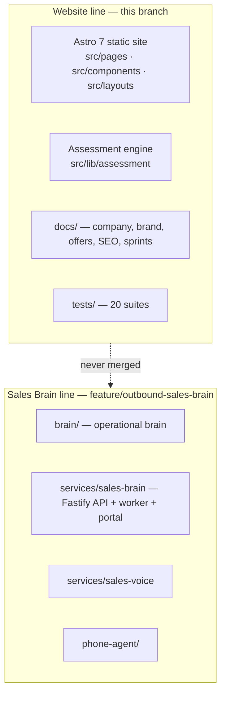
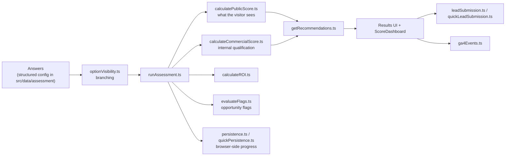

# Architecture — Your AI Department

Updated: 2026-09-16, read off the source tree at `sprint17-local-authority-proof`
(`9e4c436`). Where a statement covers the Sales Brain line, it is marked and was
read from `fix/dataforseo-standard-collector` (`d856bce`), which carries the same
service code as `feature/outbound-sales-brain`.

---

## 1. What this repository contains

One repository, two divergent branch lines (see `docs/PROJECT_STATE.md`):



The website is a **static site**. It has no server of its own: `output: 'static'`,
no adapter, no SSR. Anything that needs a secret or a database is either a
third-party endpoint or the Sales Brain service, which is a separate process
entirely.

## 2. The website

| Path | Contents |
|---|---|
| `src/pages/` | 75 `.astro` routes — offers, industries, locations, funnels, assessment, legal |
| `src/layouts/` | `BaseLayout.astro`, `FunnelLayout.astro`, `OutboundLayout.astro` |
| `src/components/` | Header, Footer, Hero, SEO, BreadcrumbSchema, ScoreDashboard, analytics and attribution components, plus `assessment/`, `funnel/`, `interior/`, `outbound/` groups |
| `src/lib/` | `site.ts`, `schema.ts` (structured data), `attribution.ts`, `repAttribution.ts`, `businessIdentity.ts`, `metaPixel.ts`, `scheduling.ts`, `bookingConfirmation.ts`, `industries.ts`, `locations.ts`, `funnels/`, `outbound/` |
| `src/lib/assessment/` | The deterministic engine — see §3 |
| `src/data/` | `assessment/`, `funnels/`, `outbound/` structured configuration |
| `src/content/` | MDX content collections (`resources/`), typed by `src/content.config.ts` |
| `tests/` | Node test runner suites, run after a build |
| `tools/generate-og-image.py` | Social image generation (not part of the build) |
| `dist/` | Build output. Gitignored; this is what gets uploaded |

Configuration (`astro.config.mjs`): `site: 'https://youraidepartment.ai'`,
`trailingSlash: 'always'`, MDX integration, and one declared redirect —
`/ai-department-audit` → `/comprehensive-ai-business-audit/`, emitted as a
meta-refresh page in static output with a note that a real 301 in SiteGround's
`.htaccess` is preferable.

## 3. The assessment engine

`src/lib/assessment/` is deterministic TypeScript, not prose and not a model:



Two experiences exist: a short public assessment (`quickScore.ts`,
`quickPersistence.ts`, `quickLeadSubmission.ts`) and a longer engine reached
through the paid path. The canonical specification is
`docs/04-assessment/implementation-spec.md`; `CLAUDE.md` forbids inferring the
logic from prose or hard-coding questions into components — it is built from
structured typed configuration, and **AI may explain a result but never
determines a score or a financial estimate**.

## 4. Analytics, attribution and consent

- `src/components/AnalyticsEvents.astro`, `AttributionCapture.astro`,
  `MetaPixel.astro` and `src/lib/attribution.ts` implement a vendor-neutral
  dataLayer contract; GTM/GA4/Ads identifiers are configuration, never
  hard-coded product values.
- `src/lib/repAttribution.ts` carries sales-rep attribution through outbound
  landing pages and into the booking handoff.
- `tests/analyticsIntegrity.test.ts` enforces an honest conversion taxonomy —
  a form view is not a lead, and developer traffic is marked so QA stops
  counting as customers (`4333317`).
- `tests/twilioA2pCompliance.test.ts` guards the SMS-consent claims the forms
  make; **a phone number is not SMS consent** (`3b4885c`).
- Booking is Cal.com (`docs/cal-booking-webhook.md`,
  `src/lib/scheduling.ts`, `bookingConfirmation.ts`).

## 5. SEO architecture

Structured data is built from `src/lib/schema.ts` and asserted by
`tests/seoQuality.test.ts` and `tests/seoContent.test.ts` — JSON-LD is parsed as
JSON rather than regex-sliced (`9dcf96a`). Sprint 17 added a locations cluster
(`src/lib/locations.ts`, `src/pages/locations/`) explicitly designed to survive
a doorway-page audit, with the rule set written down in `docs/05-seo/` so it is
not rediscovered. Sprint 14 and 16 records are `docs/sprint14-gsc-seo-optimization.md`
and `docs/sprint16-gsc-demand-expansion.md`.

## 6. Sales Brain (other line — summary only)

Documented properly in `services/sales-brain/CLAUDE.md` and
`services/sales-brain/docs/ARCHITECTURE.md` on the Sales Brain line. In short:

```mermaid
flowchart LR
  portal["Sales portal (Fastify + server-rendered HTML)<br/>src/api · src/web"] --> pg[("PostgreSQL<br/>52 SQL migrations")]
  worker["Worker — src/workers<br/>marketMiner · marketScheduler · contactResearch<br/>providerTaskSweeper · researchReconcile"] --> pg
  worker --> dfs["DataForSEO — market mining"]
  worker --> apollo["Apollo — contact enrichment"]
  portal --> cal["Cal.com — booking"]
  portal --> graph["Microsoft Graph — mail/calendar"]
```

Three processes must be running — PostgreSQL, the API and the worker — and the
one that goes missing quietly is the worker, which is why it writes a heartbeat
and `deploy/stack.sh status` reads that heartbeat from the database rather than
from the process table (`services/sales-brain/deploy/RUNBOOK-stack.md`).

## 7. Deployment

| Thing | How it ships |
|---|---|
| Website | `npm run build` → static output → uploaded to **SiteGround** VPS/cloud. No Node runtime, no adapter, no platform lock-in. `.htaccess` handles real 301s. |
| Sales Brain | systemd user services on the EdgeXpert box via `services/sales-brain/deploy/stack.sh`, with `docker-compose.yml` for PostgreSQL, plus `backup.sh`/`restore.sh` and their runbooks. |

**Documenting deployment is not authorization to deploy.** Nothing in this
repository should be pushed, uploaded or restarted by an agent without the
owner asking for it.

## 8. Secrets and data handling

- The website is static, so **anything with a secret is server-side or
  third-party by construction**. Never put an API key, CRM credential, mail or
  SMS credential in client code.
- Assessment submissions and lead data are private. They do not belong in Git,
  in `brain/`, in docs, or in analytics parameters.
- The Sales Brain service reads its configuration from environment variables
  (names only, values never in the repository): `NODE_ENV`, `DATABASE_URL`,
  `POSTGRES_DB`, `POSTGRES_USER`, `POSTGRES_PASSWORD`, `POSTGRES_PORT`,
  `SALES_PORTAL_PORT`, `SALES_PORTAL_BIND`, `SESSION_SECRET`,
  `SESSION_COOKIE_SECURE`, `CONTACT_ENRICHMENT_MODE`, `APOLLO_API_KEY`,
  `DATAFORSEO_LOGIN`, `DATAFORSEO_PASSWORD`, `BOOKING_PROVIDER`,
  `BOOKING_CALENDAR_UPN`, `BOOKING_TIMEZONE`, `CALCOM_API_KEY`,
  `CALCOM_EVENT_TYPE_ID`, `CALCOM_WEBHOOK_SECRET`, `MS_GRAPH_TENANT_ID`,
  `MS_GRAPH_CLIENT_ID`, `MS_GRAPH_CLIENT_SECRET`, `OUTBOUND_DIAL_ENABLED`,
  `OUTBOUND_EMAIL_ENABLED`, `LOG_LEVEL`, `SEED_PASSWORD` and
  `SCALE_DATABASE_URL`. `OUTBOUND_DIAL_ENABLED` and `OUTBOUND_EMAIL_ENABLED`
  are the two that can reach a real person; they are never flipped without the
  pilot gate.

## 9. Testing

```bash
npm test          # astro build, then node --experimental-strip-types --test tests/*.test.ts
```

The build runs first on purpose: several suites assert facts about generated
output (routes, metadata, structured data, funnel pages). Twenty suites cover
routing, SEO content and quality, structured data, analytics integrity,
attribution, lead submission, funnels, outbound landing pages, and the A2P
compliance claims.
