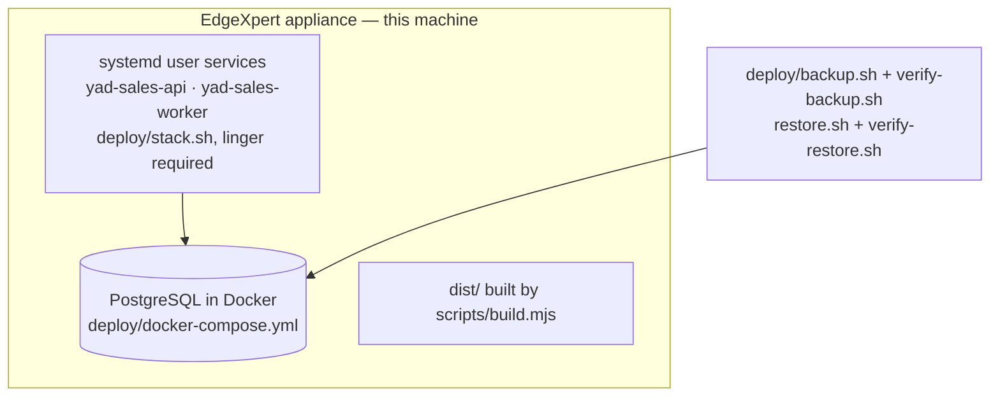

# Sales Brain — architecture

Read off this source tree on 2026-09-16 (`d856bce`, branch
`fix/dataforseo-standard-collector`, identical service code to
`feature/outbound-sales-brain`).

---

## 1. System overview

```mermaid
flowchart TB
  rep["Sales rep — browser"]
  portal["API + portal — Fastify 5<br/>src/api (routes, read models)<br/>src/web (server-rendered HTML)"]
  worker["Worker — src/workers/runner<br/>leases jobs, writes a heartbeat"]
  db[("PostgreSQL<br/>52 ordered SQL migrations")]
  dfs["DataForSEO<br/>market mining (paid)"]
  apollo["Apollo<br/>contact enrichment (paid, optional)"]
  cal["Cal.com<br/>booking authority"]
  graph["Microsoft Graph<br/>booking fallback"]
  smart["Smartlead<br/>email sequencing"]

  rep --> portal --> db
  worker --> db
  worker --> dfs
  worker --> apollo
  portal <--> cal
  portal --> graph
  portal <--> smart
```

Three processes have to be running: PostgreSQL, the API and the worker. The one
that goes missing quietly is the worker, so it writes a heartbeat row and
`deploy/stack.sh status` reads that heartbeat **from the database** rather than
from the process table — a running process is not the same as a process serving
*this* database (`deploy/RUNBOOK-stack.md`).

No ORM: `pg` plus SQL. No frontend framework: HTML is generated in `src/web`.

## 2. Data flow — from a market to a booked meeting

```mermaid
flowchart LR
  market["Market = a vertical AND a place"] --> plan["Search plan + preview<br/>src/miner/searchPlan, planPreview"]
  plan --> confirm["Operator confirms the plan<br/>(the plan confirmed is the plan executed)"]
  confirm --> tasks["Provider tasks on a ledger<br/>src/miner/providerTasks, spend.ts"]
  tasks --> dfs["DataForSEO"]
  dfs --> ingest["Listings / SERP ingest<br/>src/miner/listings, listingsIngest"]
  ingest --> resolve["Entity resolution<br/>src/resolver — one canonical Account"]
  resolve --> acct[("Accounts + evidence")]
  acct --> research["Contact research<br/>src/workers/contactResearch<br/>PUBLIC_ONLY → optional paid"]
  research --> ready["REP_READY contract<br/>found ≠ researched"]
  ready --> score["Deterministic scoring<br/>src/scoring — records its policy version"]
  score --> elig["Channel eligibility + DNC + line type<br/>src/compliance"]
  elig --> pack["Call pack<br/>src/callbrain/callPack, openerSelector, objections"]
  pack --> call["Rep call (voice controls in src/voice)"]
  call --> opp["Opportunity / meeting outcome"]
  opp --> book["Booking — Cal.com, Graph fallback"]
```

## 3. Components

| Area | Path | Notes |
|---|---|---|
| API + portal | `src/api/` (`routes.ts`, `server.ts`, `readModels.ts`, `queries.ts`, `operations.ts`, `portal.ts`) | Session auth, roles, ownership checks |
| Portal pages | `src/web/pages/` (`overview`, `find`, `lists`, `account`, `waveB/C/D`) | Server-rendered; `src/web/components.ts`, `layout.ts`, `format.ts` |
| Worker | `src/workers/` | `runner`, `marketMiner`, `marketScheduler`, `contactResearch`, `providerTaskSweeper`, `researchReconcile`, `enqueue`, `redaction` |
| Market mining | `src/miner/` | `registry`, `dataForSeoAdapter`, `searchPlan`, `planPreview`, `searchTaxonomy`, `geography`, `providerLocation`, `providerTasks`, `spend`, `canary`, `coveragePlan`, `listings`, `listingsIngest`, `miningMode`, `benchmark` |
| Domain | `src/domain/` | Accounts, merge, ownership, duplicate review, contact confidence, research completeness/facts, REP_READY, signal registry, vertical profiles, offer catalog, opportunities, hypotheses, entity status, discovery sources, roles, auth, booking access |
| Entity resolution | `src/resolver/` | One canonical Account in every arrival order |
| Call brain | `src/callbrain/` | `callPack`, `openerSelector`, `objections`, `qualification`, `intent`, `knowledge`, `prompt`, `stateMachine`, `workingMemory`, `grader`, `simulate`, `spoken`, `untrusted` |
| Voice | `src/voice/` | `dialController`, `callbackRouter`, `internalPilot`, `audioScenarios`, `relayProducer`, `salesTurnProducer` |
| Inbound | `src/inbound/` | `agent`, `resolver`, `context`, `evidence` |
| Probe | `src/probe/` | Lead-response measurement: `submitter`, `forms`, `latency`, `states`, `ledger`, `collision`, `attribution`, `identity`, `packet`, `publish` |
| Compliance | `src/compliance/` | `dncProvider`, `eligibility`, `lineType` |
| Release | `src/release/` | `gates`, `doctor`, `manifest`, `identity`, `exposurePreflight`, `canaryPacket`, `dryRun`, `dryRunMatrix`, `growthProjection`, `supportBundle` |
| Scoring | `src/scoring/` | Deterministic; every score records the policy that produced it |
| Import / export | `src/import/`, `src/export/` | List import: normalize → identity resolve → suppression → upsert |
| Email | `src/email/` | Canonical email state, eligibility gate, reply handling (Smartlead) |
| Retention | `src/retention/` | Retention classes and plans |
| Synthetic | `src/synthetic/` | Deterministic 25k/100k-account datasets for benchmarks |
| CLI | `src/bin/` | 31 entry points |

## 4. Database

PostgreSQL, plain SQL, migrations `001_foundation.sql` … `052_search_plan_preview.sql`.
Landmarks worth knowing:

| Migration | What it established |
|---|---|
| `002_accounts`, `003_evidence`, `004_ownership` | The canonical Account, its evidence, and who owns it |
| `005_markets_jobs`, `037_market_scheduling`, `050_market_disabled_outcome` | Markets and the job queue; disabling a market stops the buying, not the collecting |
| `008_read_model` | The portal's read projection |
| `013_opportunities`, `033_meeting_outcome`, `046_no_sale_conditions` | Pipeline truth |
| `017_integration_settings` | Provider configuration held in the database |
| `018_line_type_screening`, `022/023_dnc_registry`, `010_channel_eligibility` | Who may lawfully be contacted, and how |
| `028_account_merge`, `029_merged_chain`, `032_surviving_account`, `044_duplicate_reviews`, `051_entity_resolution` | Identity: merges that survive, and review decisions that stick |
| `030_job_outcome_and_worker_heartbeat`, `038_worker_draining` | Queue health as a fact rather than an inference |
| `035_provider_tasks`, `034_mining_run_attribution`, `036_source_observed` | The paid-task ledger and where evidence came from |
| `040_score_recompute`, `045_hypothesis_provenance`, `048_role_provenance` | Provenance for every derived claim |
| `041_build_identity` | What build produced this state |
| `043_retention_audit` | Retention as an audited property |
| `049_lead_response_probe`, `052_search_plan_preview` | Probe measurement; the plan a person confirms |

## 5. Authentication and authorization

Session cookies (`SESSION_SECRET`, `SESSION_COOKIE_SECURE`), login attempt
throttling (`031_login_attempts.sql`), roles in `src/domain/roles.ts`, ownership
and claim/release semantics in `src/domain/ownership.ts`, booking access in
`src/domain/bookingAccess.ts`. Authorization is asserted by
`tests/authorization.test.ts`, `readAuthorization.test.ts`,
`newSurfaceSecurity.test.ts` and `staticSecurity.test.ts`.

## 6. Paid providers and spend control

DataForSEO is the only mining provider wired in, behind
`src/miner/dataForSeoAdapter.ts`. It reports itself **unconfigured** until both
the credential and the source-governance review are present — enabled,
credentialed *and* reviewed; any one missing means no traffic. Spend ceilings
live in `src/miner/spend.ts`; a task is written to the ledger **before** the
wait and collected after, so a paid search cannot be bought and then lost. A
search we refused to buy is not counted as a search we submitted, and a daily
ceiling does not prevent collecting searches already paid for.

Apollo enrichment is off unless `APOLLO_API_KEY` is set, and
`CONTACT_ENRICHMENT_MODE` (`PUBLIC_ONLY` | `PUBLIC_THEN_PAID` |
`PAID_ALLOWED_FOR_TIER_A` | `IMPORT_ONLY`) decides whether a paid lookup is
permitted at all.

## 7. Outbound safety

`OUTBOUND_DIAL_ENABLED` and `OUTBOUND_EMAIL_ENABLED` are the only two settings
that can reach a real person. `flag()` in `src/config.ts` reads every flag the
same way and throws on an unrecognised value, because a flag whose code and
whose screen disagree is how a deliberate setting becomes a surprise call.
`npm run preflight` (`src/release/exposurePreflight.ts`) reports exactly what is
currently able to reach the outside world.

## 8. Untrusted text

Website copy and provider text reach prompts through a fenced, verified path
(`src/callbrain/untrusted.ts`), with an adversarial corpus in
`tests/injectionCorpus.test.ts` and `tests/salesAiAdversarial.test.ts`. A
crawler never follows a redirect off-host carrying an API key
(`63d97ad`, on the enrichment branch).

## 9. Release, diagnosis and handover

| Command | Question it answers |
|---|---|
| `npm run doctor` | What is happening now |
| `npm run manifest` | What is running — build identity, schema state, vertical-profile content hashes, scoring fingerprint |
| `npm run preflight` | What could reach a real person |
| `npm run miner:canary` | What a market search would cost and return, before it costs anything |
| `npm run coverage` | Market coverage, without pretending there is a denominator nobody has |
| `npm run support` | One file to hand over when something went wrong |

## 10. Deployment topology



`deploy/assert-runtime.sh` and `deploy/preflight.sh` run before a start;
`RUNBOOK-stack.md` and `RUNBOOK-backup-restore.md` are the procedures. Without
`loginctl enable-linger`, the services stop at logout and the queue silently
stops being served.
